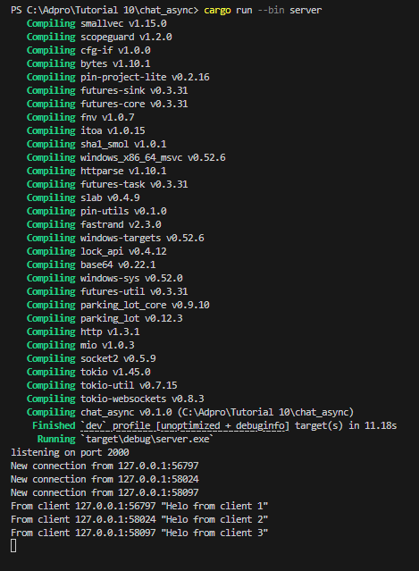
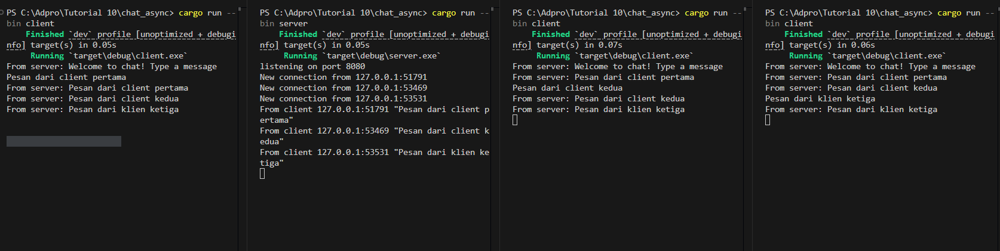

# REFLEKSI
## Fransisca Ellya Bunaren - 2306152286
### TUTORIAL

### Async Chat
Server Side

Client 1 Side

Client 2 Side

Client 3 Side

Saat program dijalankan, server menerima tiga koneksi dari klien yang berbeda melalui WebSocket. Setiap klien yang terhubung akan menerima pesan sambutan dari server berupa: From server: Welcome to chat! Type a message. Setelah itu, masing-masing klien mengirimkan pesan seperti "Helo from client 1", yang kemudian diteruskan oleh server ke semua klien lainnya. Karena itu, setiap klien akan menerima pesan seperti From server: Helo from client 1, Helo from client 2, dan seterusnya. Hal ini menunjukkan bahwa server berfungsi sebagai relay yang menyebarkan pesan ke semua klien aktif dalam sesi obrolan.

#### Modifying PORT

Agar berjalan baik, pengubahan port pada `client.rs` dan `server.rs` diperlukan. Jika salah satu dari keduanya memiliki port berbeda, `client` tidak akan bisa terhubung dengan `server`.